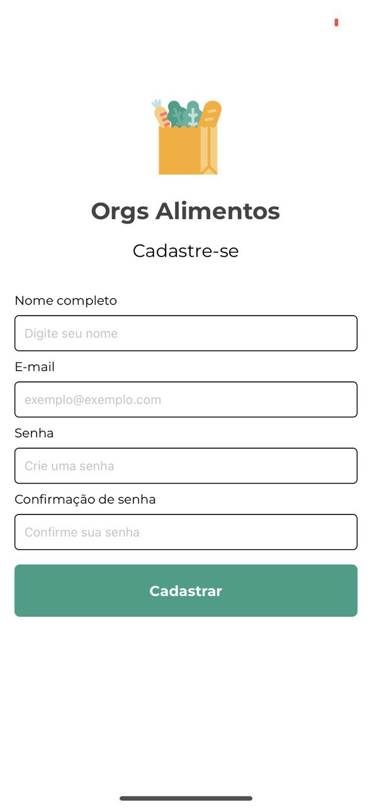
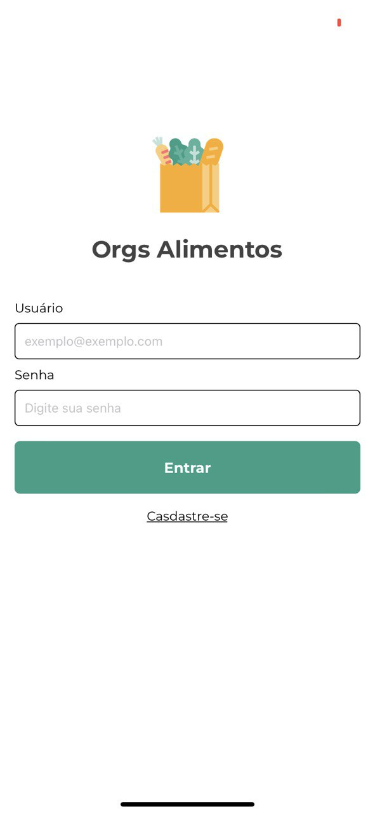
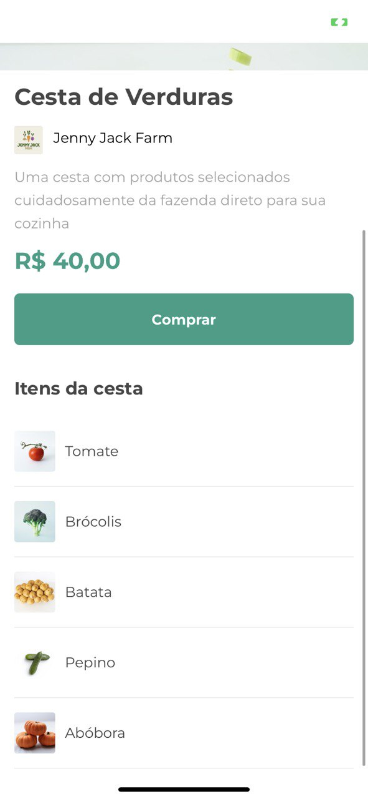

# orgs-cesta
##### Front-end E-commerce with React Native - Expo
##### Mobile application to learn some important concepts of React Native

- New Update: They were developed as registration and login screens.

     

## How to install?

### On project's folder:

- yarn

```sh
yarn
```

- npm

```sh
npm install
```

## How to run?

- yarn

```sh
yarn start
```

- npm

```sh
npm start
```
